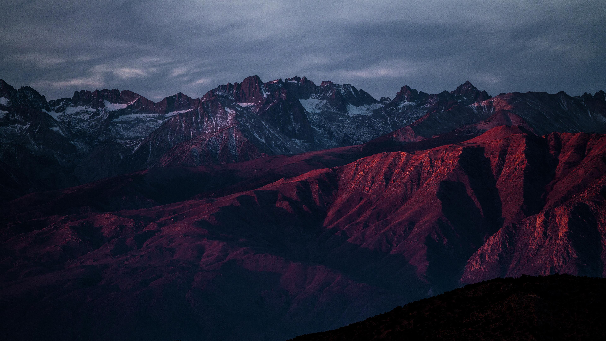
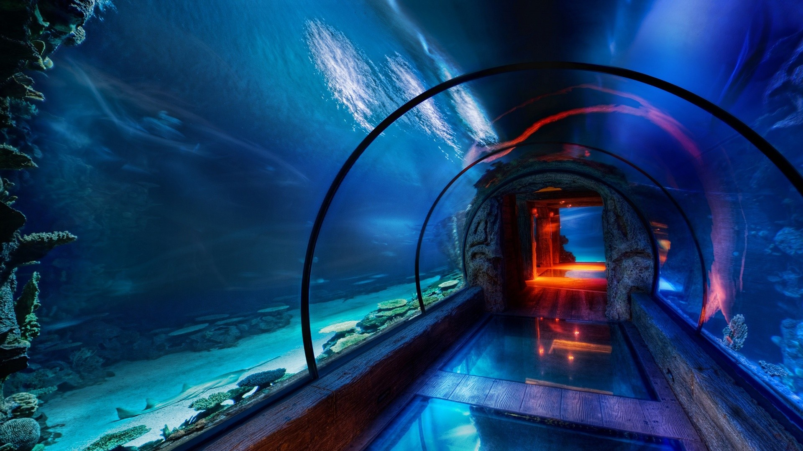

# Background Images
## Hacknet's Miami Light Blue
[file](hacknet-miamilightblue.png) | [primary source](https://hacknet-os.com/) | [secondary source](https://imgur.com/a/PwtdhTs)

## Mountains At Dusk
[file](mountains-at-dusk.jpg) | [source](https://wallhaven.cc/w/1k2p8v)

## Sunny Forest Top
[file](sunny-forest-top.jpg) | [source](https://wallhaven.cc/w/3zgdd3)

## Underwater Kitchen
[file](underwater-kitchen.jpg) | [source](https://wallhaven.cc/w/5g57l1)

## Underwater Tunnel
[file](underwater-tunnel.jpg) | [source](https://wallhaven.cc/w/0j3865)

